# Lab3_I/O_Planning  

## Introduction

In this lab you will use the uart_led design that was introduced in the previous labs. You will start the project with I/O Planning, enter pin locations, and migrate it to an RTL project. YOu will then create your own custom timing constraints with the constraints wizard. Lastly, you will perform a timing analysis.

## Objectives

After completing this lab, you will be able to:

* Create a I/O Planning project.

* Enter the pin locations and IO standards via Device view, Package Pins tab, and Tcl commands.

* Create Period, Input Setup, and Output Setup delays.

* Perform timing analysis.

  ## A note about UART.
UART is "Universal asynchronous receiver transmitter". Devices can communicate serially via the UART protocol. The UART protocol sends data in a frame, and the reciever and transmitter do not share a common clock. Instead, they agree upon a "baud" rate, which is a data transmission rate. In this case, 115200 bps. Each UART port contains a rx and tx line. Rx is the receive line, and tx is the transmit line.

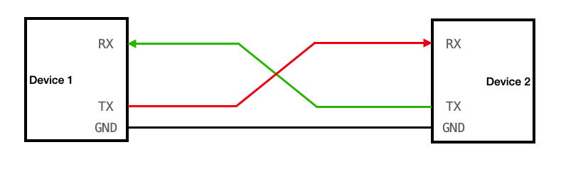

## Design Description

The design consists of a uart receiver receiving the input typed on a keyboard (emulated on the PS side) and displaying the binary equivalent of the typed character on the 8 LEDs. When a push button is pressed, the lower and upper nibbles are swapped.

In this design we will use board’s USB-UART which is controlled by the Zynq’s ARM Cortex-A53 processor. Our PL design needs access to this USB-UART. First thing we will do is to create a processing system design which will put the USB-UART connections in a simple GPIO-style and make it available to the PL section.

The provided design places the UART (`rx`) pin of the PS (processing system) on the Cortex-A9 in a simple GPIO mode to allow the UART to be connected (passed through) to the PL. The processor samples the `rx` signal and sends it to the EMIO channel 0 which is connected to `rx` input of the HDL module provided in the Static directory.

## Steps

### Step 1 Create a Vivado I/O Planning Project

* Click Create New Project to start the wizard. You will see Create A New Vivado Project dialog box. Click Next.

* Click the Browse button of the Project location field of the New Project form and click Select.

* Enter lab3 in the Project name field. Make sure that the Create Project Subdirectory box is checked. Click Next.

* Select the I/O Planning Project option in the Project Type form, and click Next.

* Select Do not import I/O ports at this time, and click Next.

* In the Default Board form, select ZYNQ AUP ZU3.

* Click Next.

* Click Finish to create the Vivado project.

    The device view window and package pins tab will be displayed.

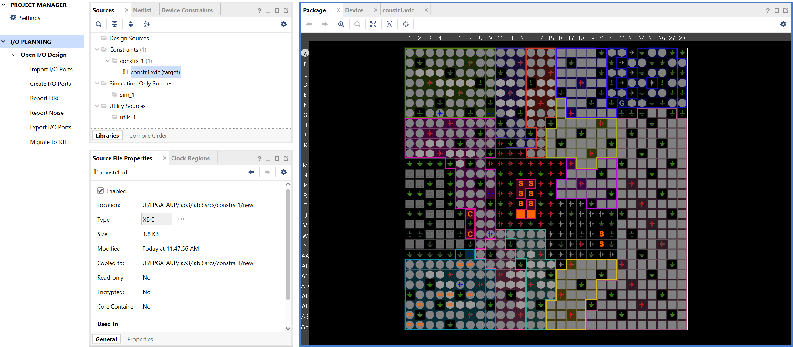

### Step 2 Create I/O Ports, Assign Various Pins and Add Source Files

* Create input ports for `clk_pin`, `btn_pin` and `rst_pin`.

* *Select Flow Navigator > I/O PLANNING > Open I/O Design > Create > Create I/O Ports*.

* Type clk_pin in the Name field, select Input for the Direction and select LVCMOS33 as the I/O Standard, and click OK.

* Similarly, create the `btn_pin`, `rxd_pin` and `rst_pin` input ports.

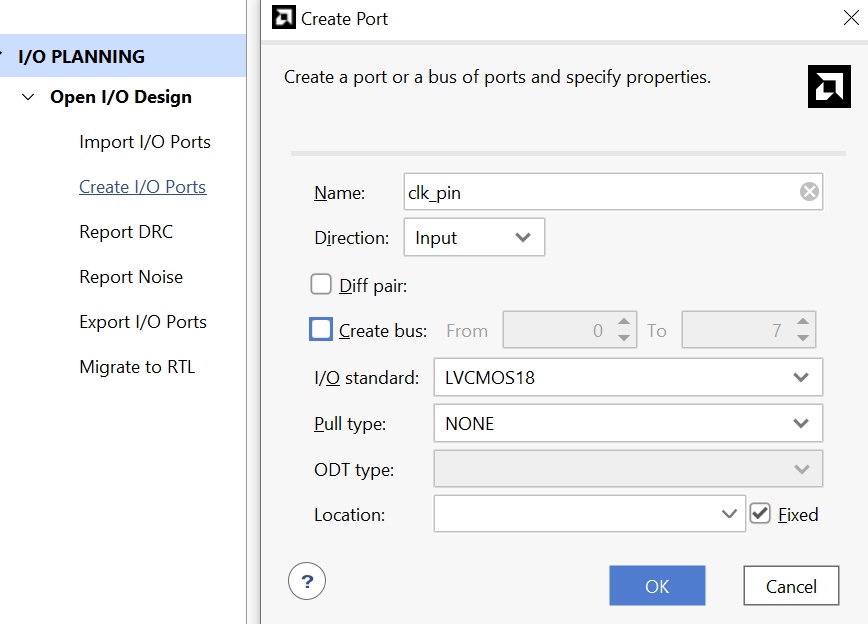

* Assign input pins `btn_pin` and `rst_pin` to AB6, AB7 locations using the Device view and package pins. Do not assign rxd_pin or clk_pin. They will be assigned later.

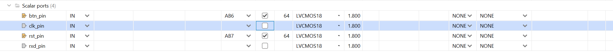

* Do the same operations and assign output `pins led_pins[0]` to `led_pins[7]` to locations AF2, AG1, AE4, AH1, AE5, AH2, AE7, AF5.
*  They all will be LVCMOS18.

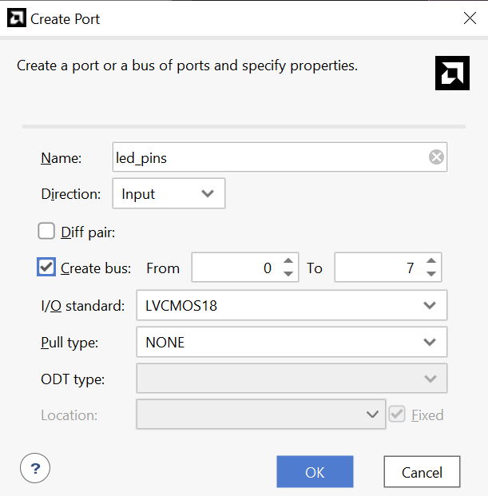

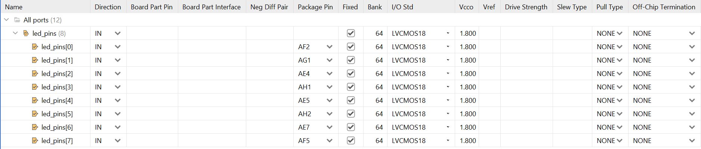

* *Select File > Constraints > Save*. Enter constr1 in the File name field, and click OK.

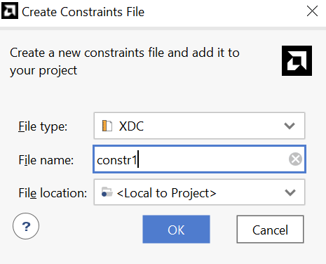

The `uart_led_pynq.xdc` file will be created and added to the Sources tab.

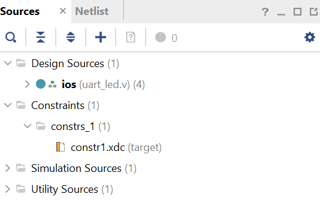

### A note about DRC
Design Rule Checks are automated checks that ensure your design is not violating electrical or logical constraints. DRC's should occur after synthesis to ensure the design in ready for implementation.

* Expand the *Flow Navigator > I/O PLANNING > Open I/O Design > Report DRC*.

* Click OK. Notice the design rules checker has run and warnings are reported. Ignore the warnings.

* Expand the *Flow Navigator > I/O PLANNING > Open I/O Design > Report Noise* and click OK. Notice the noise analysis is done on the output pins only (`led_pins`) and the results are displayed.
## Migrate to RTL
* Click on Migrate to RTL.

* The Migrate to RTL form will be displayed with Top RTL file field showing `{TUTORIAL}/io_1.v` entry. Change `io_1.v` to `uart_led.v` (AUP - ZU3), and click OK.

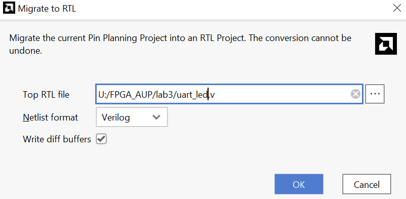

* Select the Hierarchy tab and notice that the `uart_led.v` file has been added to the project with top-level module name as `ios`. If you double-click the entry, you will see the module name with the ports listing.

* Add the source files used in Lab2 (from `Lab2/project_1/project_1.srcs/sources_1/new`, note: this directory is mine, yours might be different.) to this project, please exclude `uart_led.v` and copy the `uart_led.v` content in Lab2 into the `uart_led.v` you created after migrating operation.

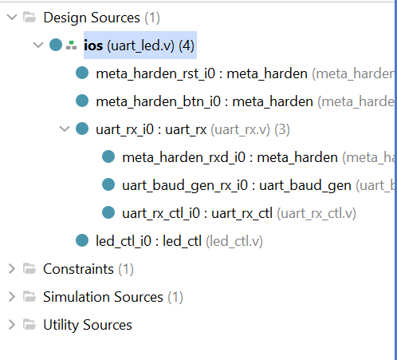

### Step 2 Synthesize the Design

#### Synthesize the design. Use the Constraints Wizard to specify a clock frequency, and input and output delay constraints.

For more detailed information about timing, please refer to the [Timing Analysis](https://people.ece.ubc.ca/~edc/2117.jan2022/lec6.pdf) and [Xilinx_timing](https://docs.amd.com/r/en-US/ug949-vivado-design-methodology/Input-Ports).
 
* Click on the Run Synthesis in the Flow Navigator pane. Click on the Save if save project window appears. When synthesis is completed a form with three options will be displayed.

* Select Open Synthesized Design and click OK.

* In the Flow Navigator pane (under Open Synthesized Design), click on the Constraints Wizard. This will open up the Constraints Wizard.

* Read the Identify and Recommend Missing Timing Constraints screen of the wizard to understand what the wizard does and click Next.

* Specify the frequency of the object `clk_pin` to be 125 MHz, notice the Period, Rise At and Fall At are automatically populated. Also notice the Tcl command that can be previewed at the bottom of the wizard. Click Next to proceed.

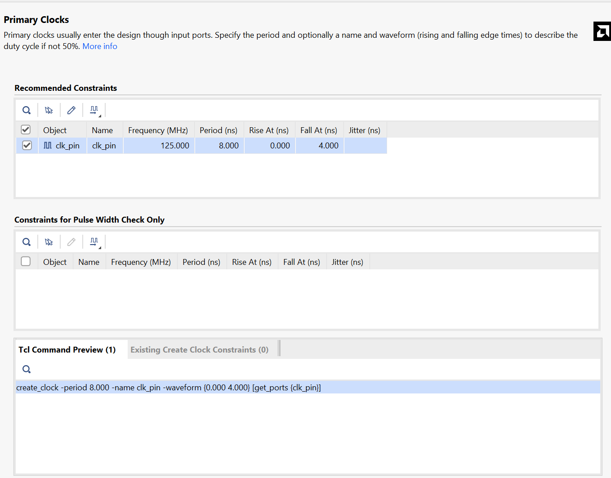

* There are no missing Generated Clocks, click Next to proceed.

* There are no missing Forwarded Clocks, click Next to proceed.

* There are no missing External Feedback Delays, click Next to proceed.

* The wizard identifies Input Delays needed for the `btn_pin` and `rst_pin` pins. Do the following:

    1. Here you will see three rows: `btn_pin`, `rst_pin`, and `rxd_pin`. We only need to identify Input Delays for the `btn_pin` and `rst_pin` pins. You will need to do the picture below for the `btn_pin` and `rst_pin`.

    2. Enter the `tco_min` value to be -0.5 ns and everything else as 0 ns. Click Apply.

    3. Notice that under the Tcl Command Preview tab, 4 Tcl commands have been generated.

    4. Click Next.

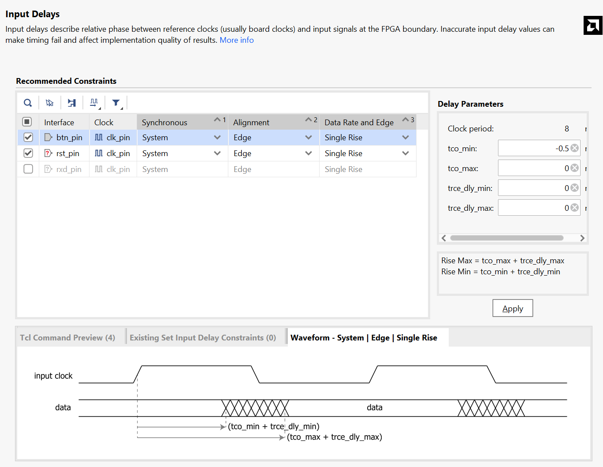

* Enter the `tsu` and `thd` as 0 ns and enter the `trce_dly_max` and `trce_dly_min` as -2.20 ns for `led_pins`. Click Apply and then click Next.

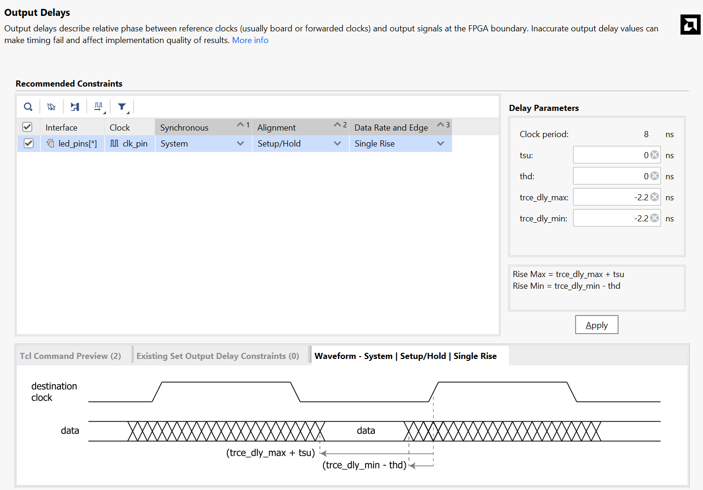

* There are no Combinatorial Delays identified, click Next to proceed.

* Click Skip to Finish to skip to the final Constraints Summary page. Read the description of each page.

* Check On Finish – View Timing Constraints and click Finish to close the wizard. The option will open the Timing Constraints Editor to show you the generated timing constraint.

* Note the wizard generated the `clk_pin` constraint for an 8 ns period (or 125 MHz) (PYNQ-Z2). Notice in the All Constraints window, 7/9 constraints will be created. There is no need to click Apply since the constraints have already been applied in the Constraints Wizard.

* Open `uart_led_.xdc` (if it was already opened, click Reload in the yellow status bar) and notice additional constraints were added to the last line of the file.

#### Generate an estimated Timing Report showing both the setup and hold paths in the design.

* Select *Flow Navigator > SYNTHESIS > Open Synthesized Design > Report Timing Summary*.

* In the Options tab, select min_max from the Path delay type drop-down list.

* Click OK to run the analysis. The Timing Results view opens at the bottom of the Vivado IDE.

* The Design Timing Summary report provides a brief worst Setup and Hold slack information and Number of failing endpoints to indicate whether the design has met timing or not. Note that there are two timing failures under the hold check. Click on the link next to Worst Hold Slack (WHS) to see the list of failing paths.

* Double-click on the Path 11 to see the actual path detail.

* Select Path 11, right-click and select Schematic.

#### Implement the Design and analyze Timing Summary

* Click on the Run Implementation.

* Click Yes to run the synthesis first before running the implementation process. When the implementation is completed, a dialog box will appear with three options.

* Select the Open Implemented Design option and click OK.

* Click Yes if you are prompted to close the synthesized design.

#### Generate a timing summary report

* Select *Flow Navigator > IMPLEMENTATION > Open Implemented Design > Report Timing Summary*.

* Click OK to generate the report using the default settings. The Design Timing Summary window opens at the bottom in the Timing tab. Note that failing timing paths are indicated in red.

* Click on the WNS to see the failing paths.

* Double-click on the first failing path from the top and see the detailed analysis. The output path delay can be reduced by placing the register in IOB.

* Similiar to Lab2, we can just delete the constraints to the led_pin (timing constraint on leds is useless in practise). 

* Select *File > Constraints > Save*. Click OK at the warning message. Click Yes to save the project.

* Click on Run Implementation.

* Click Yes to reset the synthesis run, perform the synthesis, and run implementation.

* Open the implemented design and observe that the number of failing paths in the Design Runs tab reported is 0.

* Click Report Timing Summary, and observe that there are no failing paths.

