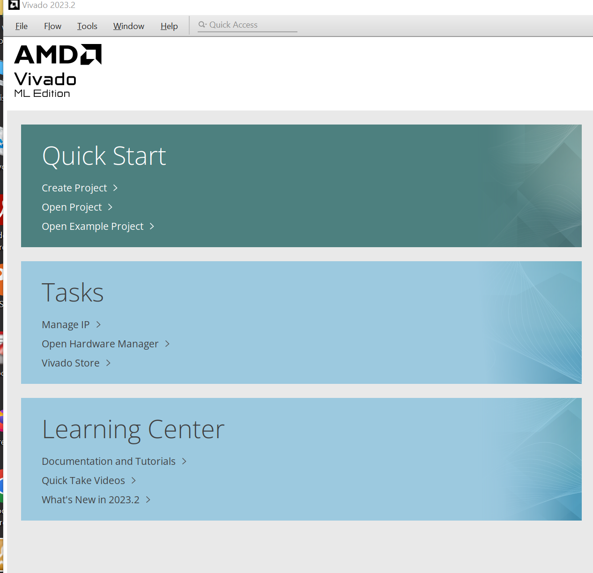
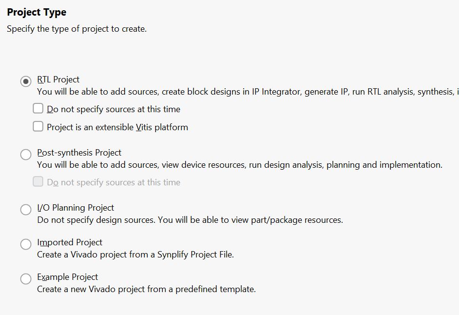

# Open Vivado

Vivado (2023.2) GUI should open as below

Click "Create Project"

Name your project the appropriate name in the subfolder

Select "RTL Project"

Next, you can choose to select a file already created, or create a new source file for your project. Which, you can always start a project with no files, and go in and add sources after the project is created.

Click Next until the "Default Part" page. There are two tabs, Parts, and Boards. Go under the boards tab, if your board is not already listed. Go to Add your board file page on this site.

Click finish.

Now your project is open. To add new sources, go to the "add sources" section under the project manager. Here you can add simulation files, sources files, and constraint file to your project as need. 

